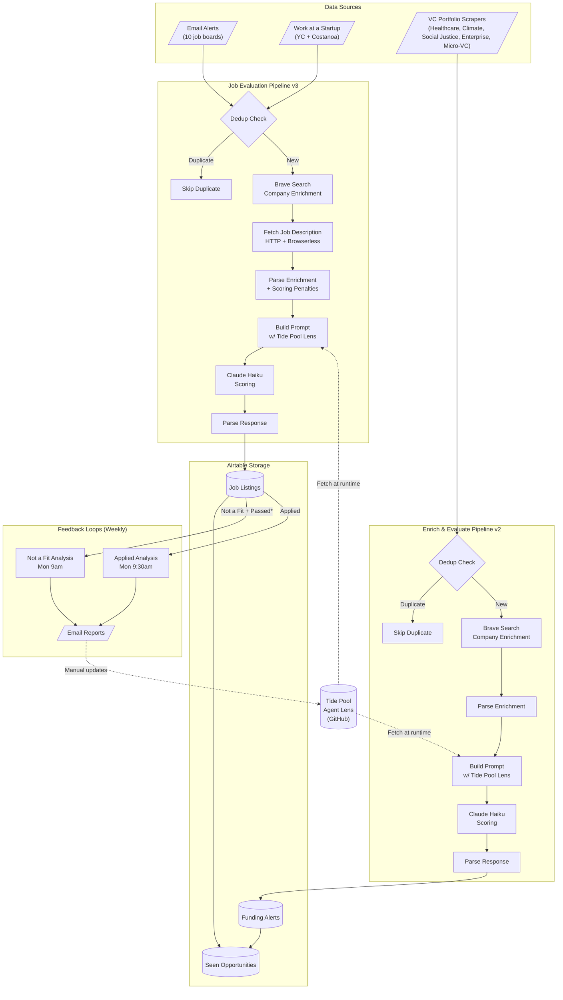
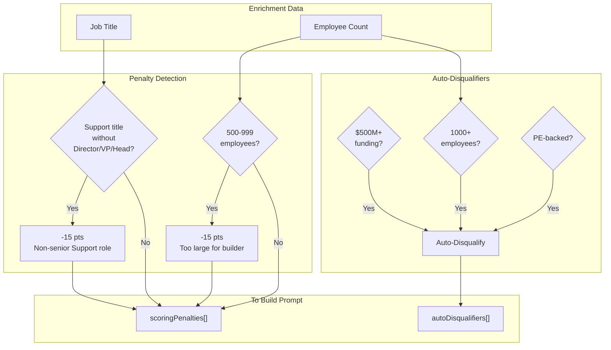
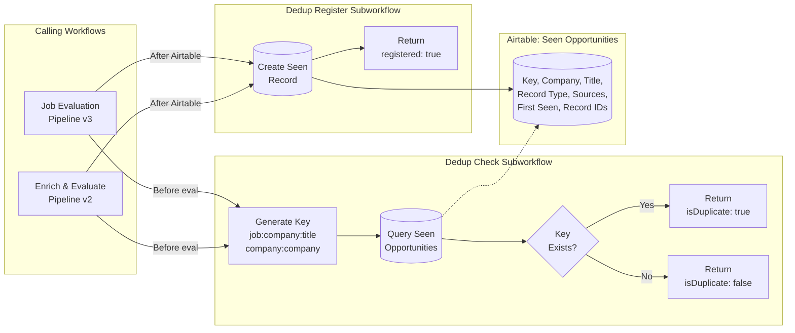
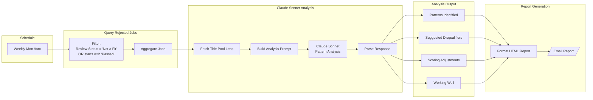
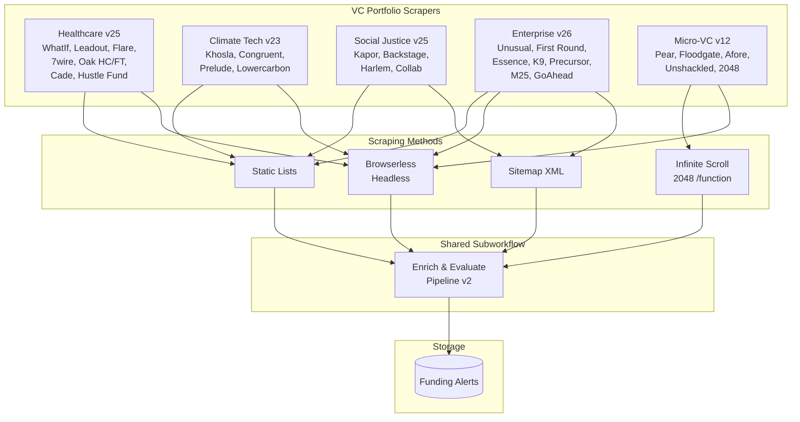
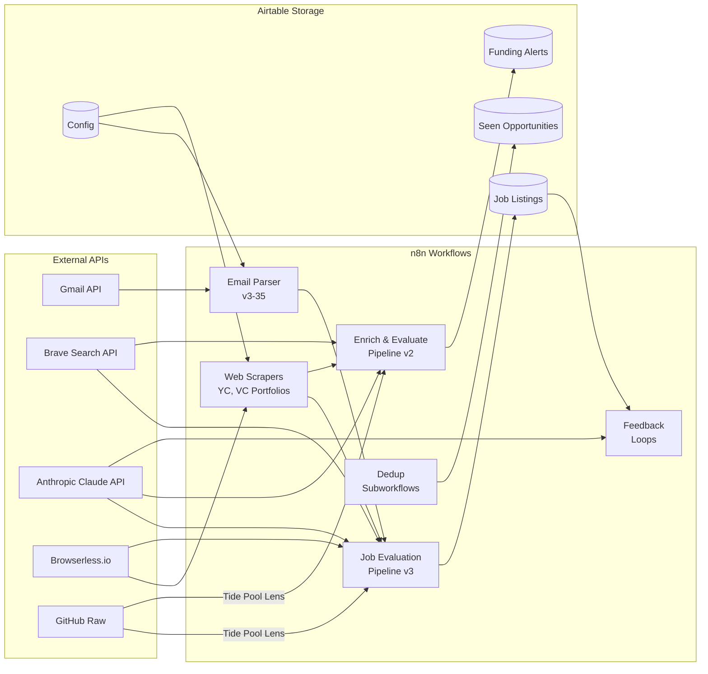

# Job Search Automation - System Flowchart

## Complete System Overview

---

## Job Evaluation Pipeline v3 (Detailed)

```mermaid
flowchart LR
    subgraph Input
        TRIGGER[Execute Workflow<br/>Trigger]
    end

    subgraph Dedup["Cross-Source Dedup"]
        PREP_DEDUP[Prepare<br/>Dedup Check]
        DEDUP_SUB[Dedup Check<br/>Subworkflow]
        IF_DUP{Is<br/>Duplicate?}
        SKIP[Skip Duplicate<br/>Return Early]
        RESTORE[Restore<br/>Job Data]
    end

    subgraph Enrichment["Company Enrichment"]
        FETCH_PROFILE[Fetch Profile<br/>GitHub]
        BRAVE[Brave Search<br/>Company]
        FETCH_JD_HTTP[Fetch JD<br/>HTTP]
        IF_HTTP{HTTP<br/>Success?}
        FETCH_JD_BROWSER[Fetch JD<br/>Browserless]
        PARSE_JD[Parse Job<br/>Description]
        PARSE_ENRICH[Parse<br/>Enrichment]
    end

    subgraph Evaluation["AI Evaluation"]
        BUILD[Build Prompt]
        WAIT[Wait 30s<br/>Rate Limit]
        CLAUDE[Call Claude<br/>Haiku API]
        PARSE_RESP[Parse<br/>Response]
    end

    subgraph Output["Storage & Registration"]
        AIRTABLE[(Upsert to<br/>Airtable)]
        PREP_REG[Prepare<br/>Dedup Register]
        REG_SUB[Dedup Register<br/>Subworkflow]
        MERGE[Merge<br/>Email ID]
    end

    %% Flow
    TRIGGER --> FETCH_PROFILE
    FETCH_PROFILE --> PREP_DEDUP
    PREP_DEDUP --> DEDUP_SUB
    DEDUP_SUB --> IF_DUP
    IF_DUP -->|Yes| SKIP
    IF_DUP -->|No| RESTORE
    RESTORE --> BRAVE
    BRAVE --> FETCH_JD_HTTP
    FETCH_JD_HTTP --> IF_HTTP
    IF_HTTP -->|Yes| PARSE_JD
    IF_HTTP -->|No| FETCH_JD_BROWSER
    FETCH_JD_BROWSER --> PARSE_JD
    PARSE_JD --> PARSE_ENRICH
    PARSE_ENRICH --> BUILD
    BUILD --> WAIT
    WAIT --> CLAUDE
    CLAUDE --> PARSE_RESP
    PARSE_RESP --> AIRTABLE
    AIRTABLE --> PREP_REG
    PREP_REG --> REG_SUB
    REG_SUB --> MERGE
```

---

## Scoring Penalties Applied in Parse Enrichment

---

## Cross-Source Deduplication Flow

---

## Feedback Loop - Rejected Jobs Analysis

---

## VC Scraper Architecture

---

## Data Flow Summary

---

*Generated: February 2026*
*Renders automatically in GitHub, VS Code (with Mermaid extension), or [mermaid.live](https://mermaid.live)*
